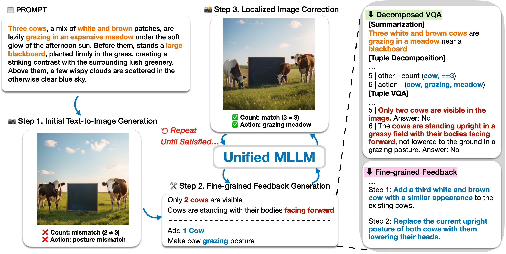

<div align="center">

# Enhanced Text-to-Image Generation by Fine-grained Multimodal Reasoning

[](https://arxiv.org/abs/2604.13491)
[](https://github.com/KU-AGI/FiMR)
[](https://huggingface.co/KU-AGI/FiMR)

**Official implementation of Enhanced Text-to-Image Generation by Fine-grained Multimodal Reasoning**


</div>

# 📋 TODO
- [x] Paper release
- [x] Model checkpoint release
- [ ] Release inference code
- [ ] Release training code

# 📌 Paper Overview
**FiMR** enhances text-to-image generation in unified MLLMs through fine-grained multimodal reasoning. By decomposing prompts into semantic units and verifying them with VQA, FiMR generates explicit feedback for targeted refinement, leading to better image-prompt alignment and stronger performance than prior reasoning-based baselines.

# 🐍 Environments

```bash
conda create -n fimr python=3.10 -y
conda activate fimr
pip install -r requirements.txt
```

> **Note:** `flash_attn` requires a matching CUDA toolkit. If the above fails on `flash_attn`, install it separately:
> ```bash
> pip install flash-attn --no-build-isolation
> ```

# 🧠 Inference

## 1. Clone Benchmark Repositories

Each benchmark must be cloned separately. Update the paths in `configs/dataset/eval.yaml` to match your local setup.

**GenEval**
```bash
git clone https://github.com/djghosh13/geneval /path/to/geneval
```

**DPG-Bench** (part of the ELLA repository)
```bash
git clone https://github.com/TencentQQGYLab/ELLA /path/to/ELLA
```

**T2I-CompBench**
```bash
git clone https://github.com/Karine-Huang/T2I-CompBench /path/to/T2I-CompBench
```

Then edit `configs/dataset/eval.yaml`:
```yaml
geneval: /path/to/geneval/prompts/evaluation_metadata.jsonl
t2icompbench: /path/to/T2I-CompBench/examples/dataset
dpgbench: /path/to/ELLA/dpg_bench/prompts
```

## 2. Download Model Checkpoint

```bash
huggingface-cli download KU-AGI/FiMR --local-dir ./checkpoints/FiMR
```

## 3. Run Inference

Edit the variables at the top of each script (`CKPT_PATH`, `SAVE_PATH`, `EXP_NAME`, `WORLD_SIZE`, `BATCH_SIZE`) to match your setup, then run from the project root:

**GenEval**
```bash
bash scripts/eval/run_geneval.sh
```

**DPG-Bench**
```bash
bash scripts/eval/run_dpgbench.sh
```

**T2I-CompBench**
```bash
bash scripts/eval/run_t2icompbench.sh
```

Generated images are saved to `<SAVE_PATH>/<EXP_NAME>/<task_name>/`.

### Self-Correction Options

| Option | Description |
|---|---|
| `use_self_correction` | Whether to run the self-correction loop after initial generation. If `True`, the model generates an image, reasons over it with VQA, produces corrective feedback, and edits the image — repeating up to `max_correction_steps` times. If `False`, only the initial generation (`gen/`) is produced. |
| `max_correction_steps` | Maximum number of correction iterations. A value of `N` produces stages `gen/`, `correction_0/`, ..., `correction_{N-1}/`. Corrects early if VQA determines the image already satisfies the prompt. |


# 🤗 Acknowledgment

We sincerely thank the authors of [Janus-Series](https://github.com/deepseek-ai/janus) and [Janus-Pro-R1](https://github.com/wendell0218/Janus-Pro-R1?tab=readme-ov-file) for making their models and code publicly available.

# 📝 Citation
```bibtex
@misc{kim2026enhancedtexttoimagegenerationfinegrained,
      title={Enhanced Text-to-Image Generation by Fine-grained Multimodal Reasoning}, 
      author={Yongjin Kim and Yoonjin Oh and Yerin Kim and Hyomin Kim and Jeeyoung Yun and Yujung Heo and Minjun Kim and Sungwoong Kim},
      year={2026},
      eprint={2604.13491},
      archivePrefix={arXiv},
      primaryClass={cs.CV},
      url={https://arxiv.org/abs/2604.13491}, 
}
